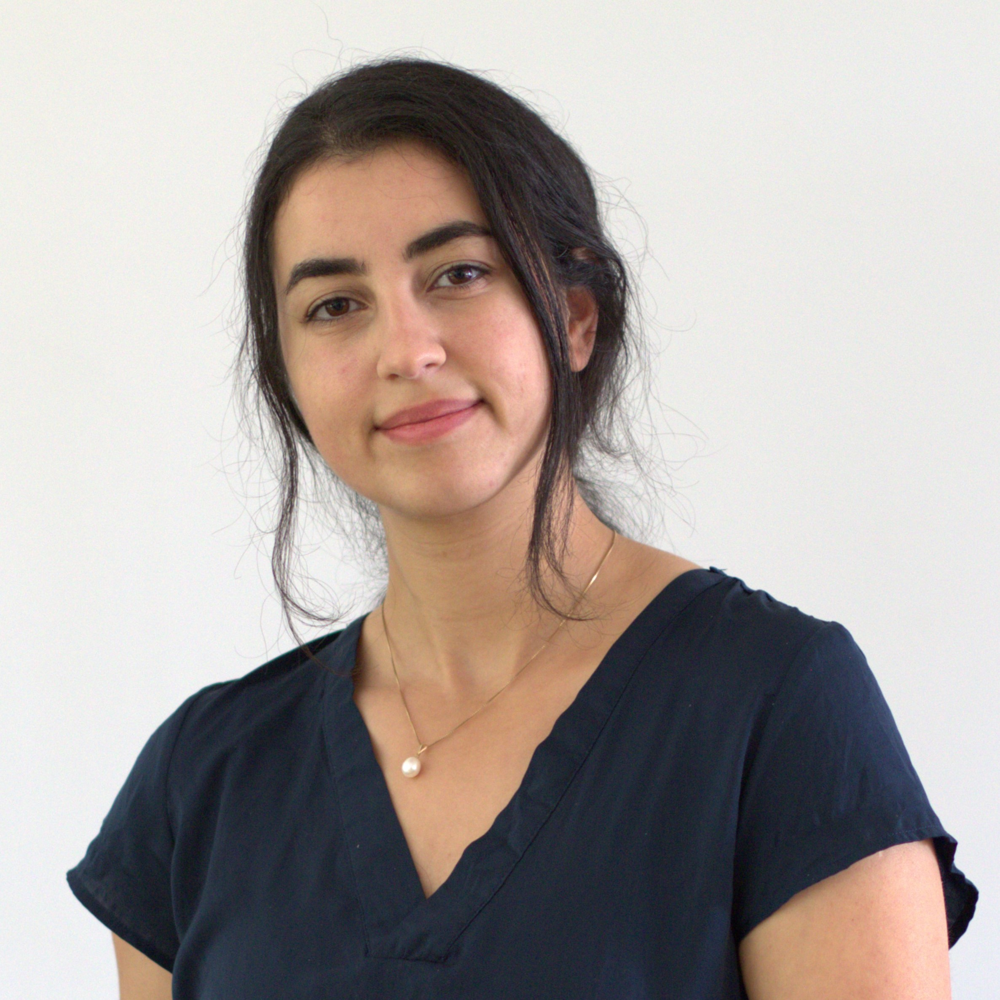

### Hi there 👋 My name is Lucia Cani 😄                                      

#### Im studying to become a fullstack developer and data scientist 💻📈     

👀 I Like: SQL, C#, Python, Tenserflow, Javascript
✨ Also:  Photography, Being in Nature and Thinking about the big Philosophical questions.

🌱 I’m currently learning team building skills.

🔭 I’m currently working at Linespotting AB as a Data science intern, leading a team of student on a project at the company.

📫 How to reach me:  [linkedin]( https://www.linkedin.com/in/lucia-cani-681463257/) or by Email: oluciacanio@gmail.com

<!--
**00Lucia00/00Lucia00** is a ✨ _special_ ✨ repository because its `README.md` (this file) appears on your GitHub profile.

Here are some ideas to get you started:

- 👯 I’m looking to collaborate on ...
- 🤔 I’m looking for help with ...
- 💬 Ask me about ...

- 😄 Pronouns: ...
- ⚡ Fun fact: ...
-->
